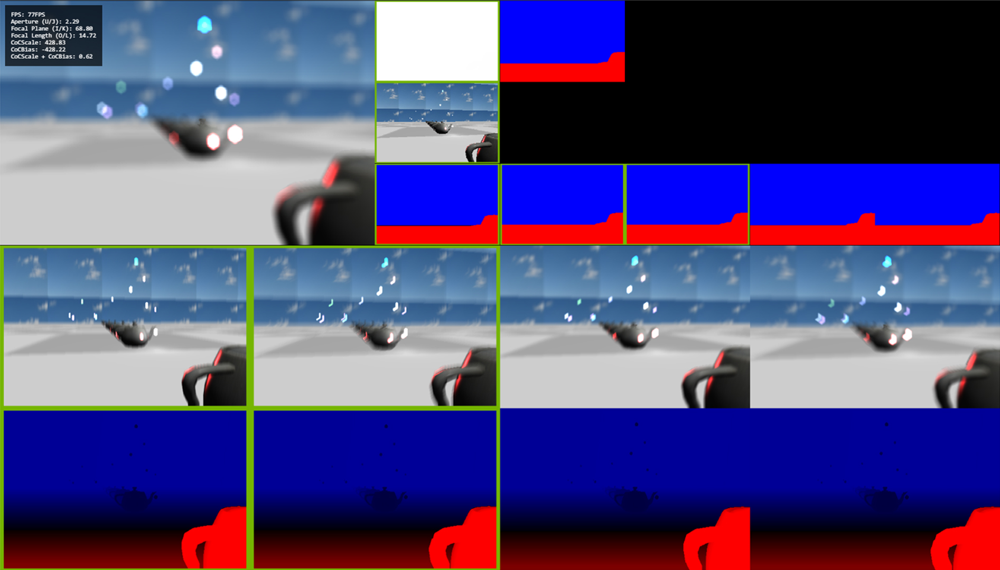
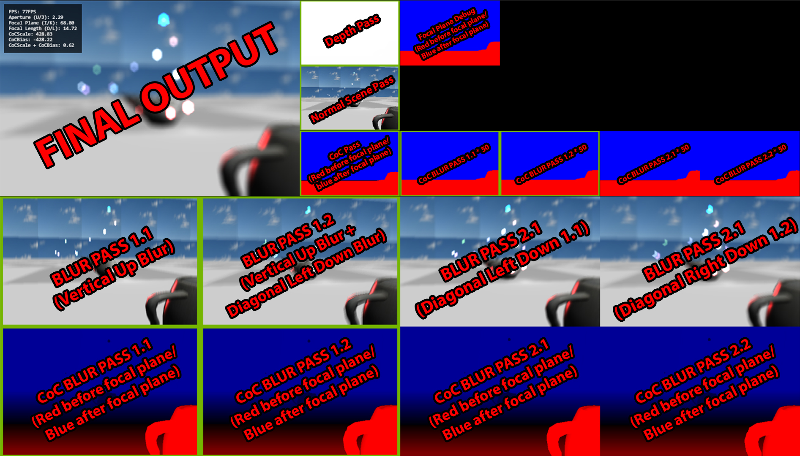

# SeparableBokeh_DoF_WebGL
Separable bokeh dof implementing this effect following this article:
http://www.polygonpi.com/?p=867

The Bokeh rendering algorithm is under js/Renderer => drawBokehEffects()

For debbuging purposes the project outputs various intermediate results of the Bokeh effect:

